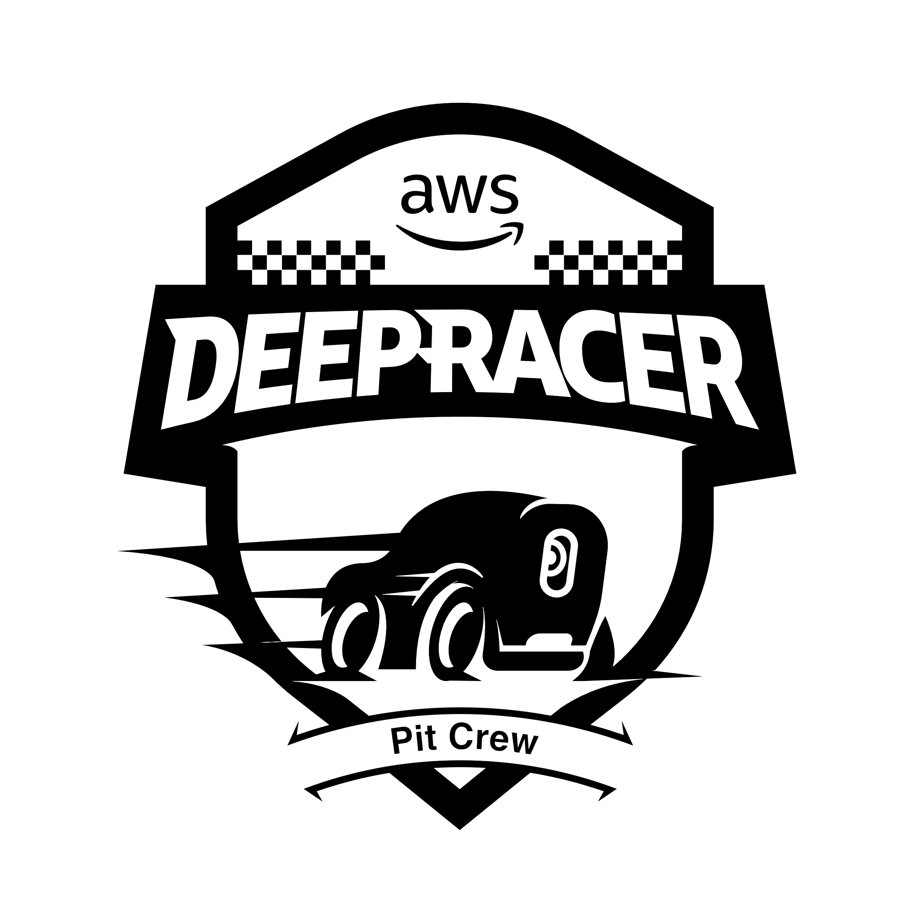

	 

# DeepRacer Events - Role Guide

## Crew Chief

The Pit Boss is the most critical position for customer experience at AWS DeepRacer events. The Crew Chief helps them maintain a high bar at large events.

Crew Chiefs are responsible for interacting with racers and preparing them to race, assisting Pit Bosses loading models onto the cars, maintaining the flow of racers through the track, and supervising, training, and coaching Pit Bosses throughout events.

### TENETS

* Keeping the cars and the customers racing
* Customer Experience is the priority

### REQUIREMENTS

* Wear appropriate clothing (Depending on the type of event) to move comfortably in, be aware you could be on your feet for the duration of your sift or the event.
* Have served as Pit Crew for multiple events (1P and Customer)
* Selected by Pit Crew Lead for the event - no open signups
* Be familiar with any rules for the event (aware of standard rules and any differences for this particular event) - including number of resets (only important at some events) and order of racers
	* Review Event Info sheet - to be taped to the Pit Boss table
* Be familiar (able to train others) with the general car mechanical functions and any issues that may prevent it from racing
	* Able to explain and troubleshoot car functions
	* Specifications for changing batteries - percentages depending on type
	* For any league or professional racing - be able to explain the car calibration at a detailed level
		* Calibration standards as established in documentation
* Be familiar (able to train others) with the car web interface - how to load models and troubleshoot issues
* Be familiar with DREM (DeepRacer Event Manager) interface and procedures - searching for and loading models
	* Have access to DREM credentials
	* Be familiar with fallback procedures in the event of DREM outages and/or connectivity issues - to be implemented by the Pit Crew Lead as necessary
* Familiarity with event networking and failure scenarios - how to tell things are broken and where the issue is occurring
	* Distinguish between car interface issues and network connectivity issues
	* When car inferencing is failing
* Coordinate with Track Boss / Timekeeper / Racers as needed
* Work closely with Pit Boss(es) to maintain a race cadence
* Follow process established by Pit Crew Lead for the given event
* Provide feedback on the event and processes to the Pit Crew Lead and/or the post-event survey
* Optional but highly recommended
	* Pit Crew Leadership Certified or In Training

### RESPONSIBILITIES

* Arrive early (~15 minutes - on time is late) for your shift as applicable to coordinate with the outgoing shift and check in with the Pit Crew Lead
* Time is critical at most events - the Crew Chief helps the Pit Bosses keep the pace and moves quickly to keep races moving while loading models, instructing racers, and troubleshooting as necessary
* Check in with and brief Pit Boss(es) for the shift on any special procedures
* Verify Pit Boss table has appropriate equipment - (Exact numbers will vary depending on the equipment in use and the event)
	* 3 - 6 DeepRacer cars
	* 2 - 4 Car control tablets
	* LiPo battery tester / Fuel Gauge
	* Spare drive batteries (request additional from mechanic if running low) - as many as possible without the Pit Boss table appearing cluttered
		* Drive batteries are replaced more frequently than compute batteries
		* Compute battery replacement frequency varies depending on version
			* “New” Excitrus batteries (re:Invent 2022) are replaced more frequently than “original ASUS” batteries (approximately ~80%)
			* Push cars to mechanic for compute battery replacement - mechanic in the pit area will pick up
		* Prioritize a clean table no unnecessary equipment to be on the table, no food or drink.
			* Cars and peripherals only as necessary
	* Flash Drives (if not using DREM)
	* Laptop(s) for model loading (if using DREM)
* __Keep the Pit Boss table and track-side environment neat and clear of bags/drinks/food throughout the event__
	* If possible - have a designated storage area for drinks - cabinet next to the track or similar - bags and food should go in the maintenance or storage area as applicable
* Prior to the start of the race - verify cars that will be in use with Mechanic or Pit Crew Lead - test as necessary on track and / or verify that cars were tested prior to customer racing
* Interact with customers in line and facilitate the model loading and race preparation process
	* You are the immediate face of DeepRacer to the customer - keep this in mind when interacting with them and instructing them on the racing process - they will remember the experience they had and you directly impact that
	* Help the customer have fun - encourage them and cheer them on
* Monitor the racing with the Track Boss and Timekeeper
* Assist Track Boss and Timekeeper with calling valid laps and/or off-tracks
* Coach the customer as they race - offer advice on adjusting the speed
* If the racer is abusing the equipment
	* Not slowing the speed when the car is crashing repeatedly or running the car hard into walls
	* Making the Track Boss work harder than necessary through over driving a bad model
	* The Track Boss has the primary responsibility to end the current race, but the Pit Boss may also end the current race at their discretion.
		* Work with the Track Boss to first warn, and then disqualify the lap / racer as appropriate - all racers are to be given at least one warning (The fastest way to get a racer to pay attention is to stop timing)
	* Be aware of swapping cars as necessary beyond the alternating for each race - if cars are running for the whole day, they may overheat
* Replace batteries as necessary
	* LiPo batteries should be replaced when they reach ~50-60% charge (roughly every 4-6 races)
		* For a "Final" each racer should have a fresh LiPo battery
	* Compute batteries should be replaced when they reach ~40-50% charge (time varies depending on battery) and more often during any league racing (70-80%). Transfer the car to the mechanic for replacement of the compute battery.
		* “New” (re:invent 2022) batteries show noticeable degradation around 80% - replace at that point for league events or similar (don’t start a new race if the battery is below 80% for league racing)
		* “Original” (ASUS) batteries can be replaced at ~50% (two dots)
	* Check batteries after each car is run on the track and verify state before loading the car with the next racers model
		* Verify LiPo battery percentage (Below 70%, swap it out)
		* Verify compute battery percentage
	* Work with the Mechanic to ensure a supply of charged batteries
	* Verify against event info sheet for each event
* Triage car issues as they arise
	* Minimize troubleshooting track-side to issues that can be resolved quickly
	* Escalate more complex car issues to the Mechanic and/or the Pit Crew Lead as necessary
	* 	If troubleshooting takes more than 60-90 seconds, the car should be transferred to the Mechanic - Pit Bosses should be spending their time with customers and not extensively troubleshooting cars
*  Work with other Pit Crew to proactively resolve any issues as they arise - prioritizing those that prevent racing - and assist in escalation to the Pit Crew Lead as necessary.
*  At the end of your shift, coordinate with the incoming shift and check out with the Pit Crew Lead before you leave Large Events (all events with a Crew Chief are likely large events):
	*  If multiple Pit Crew are assigned to Pit Boss - while one Pit Boss is working with the active racer (on-track) the secondary/tertiary pit bosses will work with loading models for the next racer(s) in line on other cars. Following the completion of the active race, that Pit Boss will work with the next customer in line and the secondary Pit Boss will become the “on-track” Pit Boss.
	*  Queue management is critical in maintaining the flow of racers during a large event - all Pit Bosses need to work together to manage those customers next in line and ensure they are preparing cars and racers to minimize downtime between races. Aim for N+1/+2 cars prepared to race while one car is on the track - secondary car ready for the racer if the first car has an issue.
	*  There may be a secondary Mechanic / Pit Boss assigned to the track-side area during large events to proactively troubleshoot car issues and stock batteries at the Pit Boss table.
	*  For events or races with a known order of racers - load models ahead of time or reference a schedule taped to the Pit Boss table 
	*  Coordinate with the Pit Crew Lead for stanchions/barriers behind the Pit Boss table - if this is not possible or practical, be aware of your surroundings and equipment on the table - thefts can and do occur at large events
	*  In situations where network conditions dictate - the Pit Crew Lead may request that the Pit Bosses minimize the number of devices on the network - if this is the case, only the active car (and associated tablet) and two backups should be powered on at the pit boss table and all other cars/tablets should be powered off
*  If there are no racers in the queue - circulate around the track and engage with customers who walk up to observe the race and explain what DeepRacer is and encourage them to have a go with one of the default models.